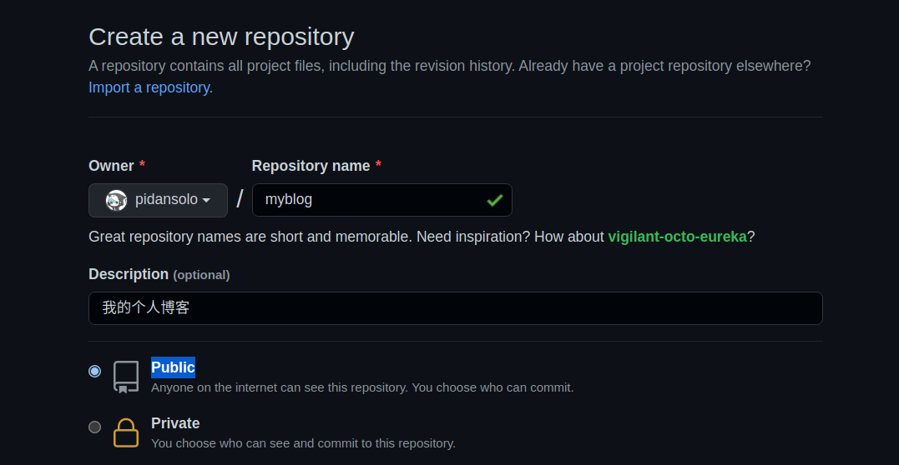
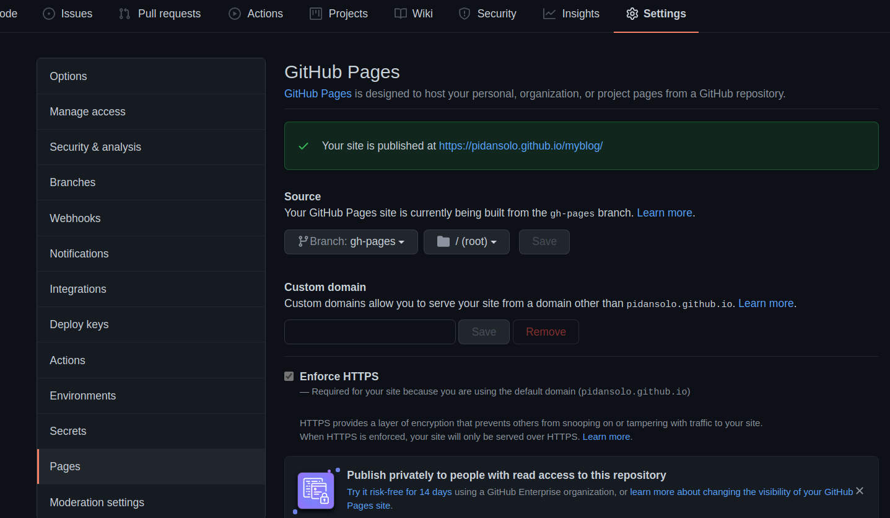
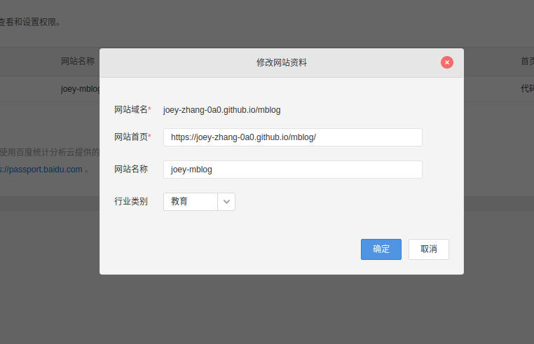
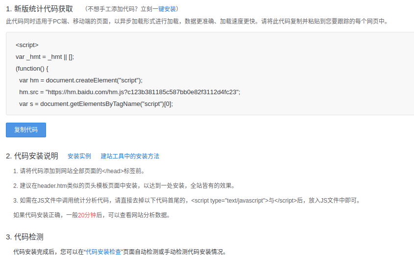
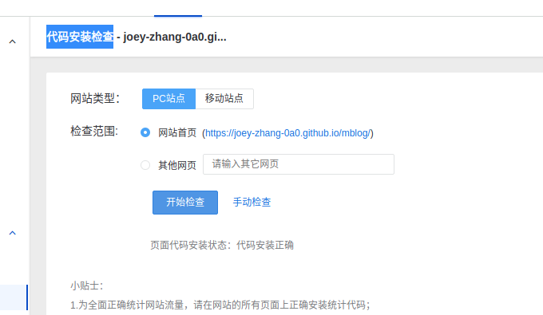
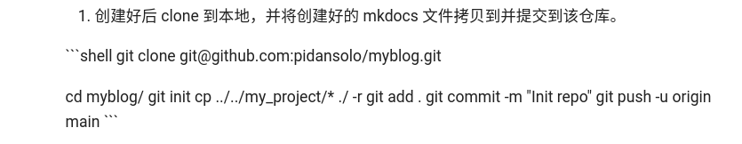

> 本文记录个人博客的搭建方法


| 版本号 | 作者                         | 修改时间   | 修改说明 |
| ------ | :--------------------------- | ---------- | -------- |
| v1.0   | Joey zhang 2298667492@qq.com | 2021-11-25 | 初始版本 |


## 简介

本人工作快3年了，从最开始的用笔和纸记录，到用 vim 打开 txt 文件记录，再到使用 typora 创建本地 markdown 文件记录。记录的方法一直在更新，但一直局限于本地。虽然平时记录的非常杂乱，但我还是想将我的积累分享到网上，也给自己一个更方便的查看方式。同时暗示自己不再是写给自己看了，后续需要写的更加规范，条理更加需要清晰。

本文介绍的是基于 mkdocs 并参考其他人的博客完成搭建。(在资料中有引用的记录)


## 环境搭建

### mkdocs基础环境搭建

1、安装工具

```shell
sudo pip3 install mkdocs mkdocs-material
```

2、初始化项目

```shell
zy@zy:myblog$ mkdocs new my_project
INFO     -  Creating project directory: my_project
INFO     -  Writing config file: my_project/mkdocs.yml
INFO     -  Writing initial docs: my_project/docs/index.md
```

3、启动服务，执行后浏览器输入 http://127.0.0.1:8000/ 即可看到本地博客内容。

```shell
zy@zy:myblog$ cd my_project/
zy@zy:my_project$ mkdocs serve
```


### mkdoc高级功能

mkdocs.yml 文件是页面配置文件

1、添加页面和导航条，[官网文档](https://www.mkdocs.org/getting-started/#adding-pages)

修改 mkdocs.yml 文件

```yaml
site_name: My Docs test!!!

nav: #navigation header 导航标题
- 测试1: test1.md    # 测试1是导航栏的显示，test1.md 是文件的相对路径
- 测试2: test2/test2.md
- 测试3: 
- 3测试: test3/test3.md
```

增加对应的md文件

```shell
zy@zy:my_project$ tree .
.
├── docs
│   ├── index.md
│   ├── test1.md
│   ├── test2
│   │   └── test2.md
│   └── test3
│       └── test3.md
```

2、添加主题，需要安装 [mkdocs-material](https://squidfunk.github.io/mkdocs-material/)

```yaml
theme:
name: material
```

更多主题相关的高级配置 [here](https://squidfunk.github.io/mkdocs-material/creating-your-site/#advanced-configuration)

3、更多高级设置，等待有空研究 [here](https://cyent.github.io/markdown-with-mkdocs-material/appendix/pygments/)


### 部署到GitHub上

之前的步骤完成后我们可以在本地或者局域网内访问，但为了在更多平台以及外网访问，我们需要借助 github 这个代码托管平台。

1、首先在 github 上新建一个仓库，注意一定要选择 Public 属性，否则后面的 GitHub Page 无法使用。



2、创建好后 clone 到本地，并将创建好的 mkdocs 文件拷贝到并提交到该仓库。

```shell
git clone git@github.com:pidansolo/myblog.git

cd myblog/
git init
cp ../../my_project/* ./ -r
git add .
git commit -m "Init repo"
git push -u origin main
```

3、通过 mkdocs gh-deploy 命令进行发布。该命令会在仓库中自动创建一个 gh-pages 分支并生成对应文件。

```shell
mkdocs gh-deploy
```

4、登入 github 该项目的 setting 界面，选择刚才 gh-pages 做为数据源



5、然后你就可以直接浏览器访问了 https://pidansolo.github.io/myblog/

6、更新博客。

```shell
# 1. 修改或增加相关文件

# 2. 先本地测试一下是否有问题
mkdocs serve

# 3. 将文件提交到main分支
git add 
git commit -m "Update"
git push -u origin main

# 4. 更新部署分支
mkdocs gh-deploy
```


## 高级功能

## 1. 增加百度统计

使用百度统计可以看到站点流量情况。[百度统计](https://tongji.baidu.com/) 注册私人账号即可用。

首先按照下面方式将自己博客相关信息导入。



导入后会生成代码，将代码复制下来。



在blog目录下面创建 docs/js/baidu-tongji.js 文件并将代码粘贴进去，主要看上图中**代码安装说明**里面的3，需要将头尾去掉

```shell
zy@zy:mblog$ cat docs/js/baidu-tongji.js
var _hmt = _hmt || [];
(function() {
  var hm = document.createElement("script");
  hm.src = "https://hm.baidu.com/hm.js?c123b381185c587bb0e82f3112d4fc23";
  var s = document.getElementsByTagName("script")[0]; 
  s.parentNode.insertBefore(hm, s);
})();
```

然后在 mkdocs.yml 文件中加入下面引用。

```yaml
extra_javascript:
  - 'js/baidu-tongji.js'
```

全部完成后 push 到 GitHub Page 即可。

通过百度统计上面的检测功能检测是否安装成功。




## 其他

### 显示shell格式错误



问题是tab导致的，把出现问题的行 ```shell 部分的全部左对齐不要有tab或空格就行。但在typora中显示是正常的，可能typora中有特殊处理过。


### 关于图片插入的方法
只需要在项目中建立一个目录把图片放入其中，然后在引用时指定相对该文档的相对路径即可。
如我喜欢在每个分类目录下建立picture文件夹，然后放入图片，然后类似这样引用即可``


## 资料

感谢以下链接对本文章的帮助！

[我的mkdocs引路人](https://wiki.noodlefighter.com/)

[mkdocs官网](https://www.mkdocs.org/)

[mkdocs高级功能中文介绍](https://cyent.github.io/markdown-with-mkdocs-material/)
